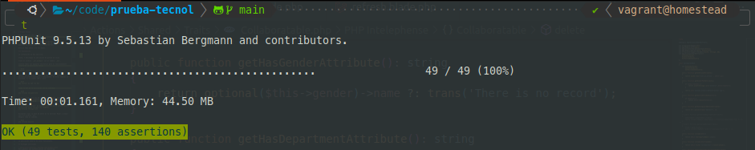
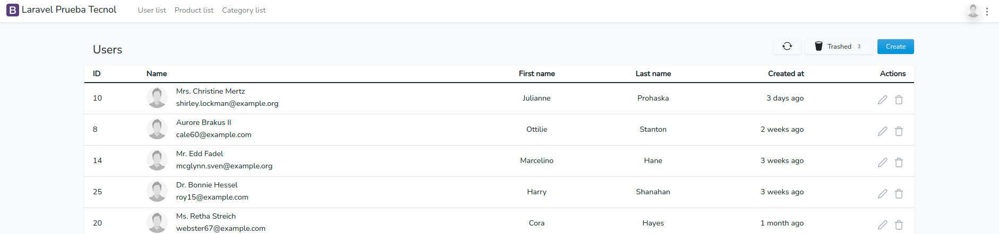
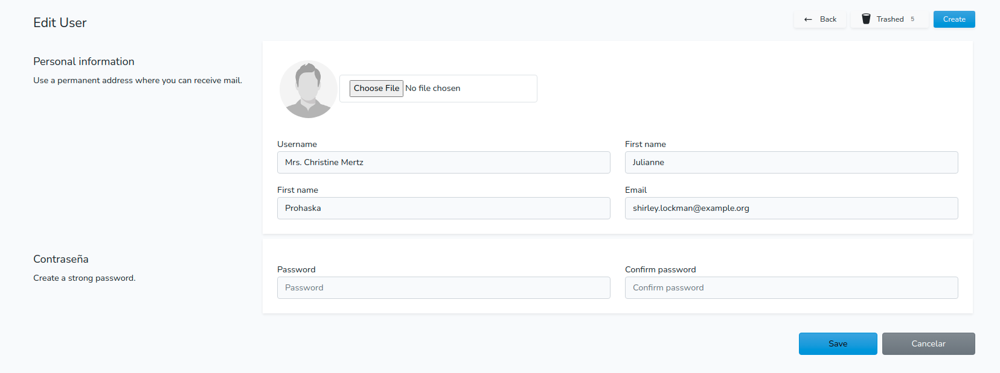
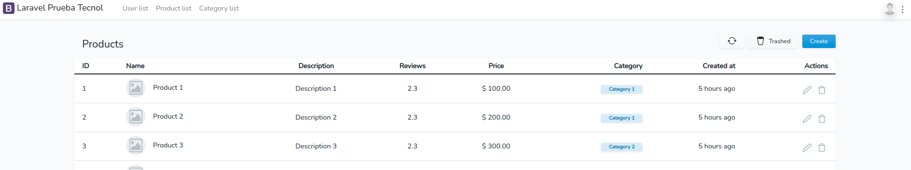
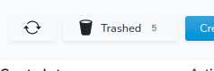
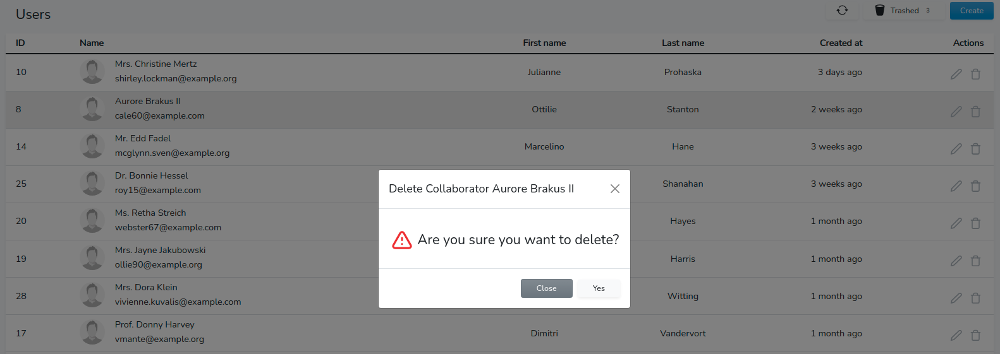

# Prueba Tecnol

Mini aplicación para un test.
## Requerimientos

- PHP 8.0 en local
- Composer instalado. Si posible la versión 2.
- Node instalado para poder instalar en la aplicacion los paquetes de javascripts, css y comprimirlos.

Esto es todo ahora 🤞🏽 los dedos.

### Instalación

La instalación es muy sencilla.

Clone, o descargue la aplicación de github en local.

Clone el archivo `.env.example` con el nombre `.env`.

Instale todos los paquetes necesarios para el funcionamiento interno de la aplicación con: 

```bash
composer install
```

Instale los paqueste de node para que todos los archivos necesarios este disponibles y comprimidos. De ellos depende el Frontend, si no añades CDN's claro.

```bash
npm install && npm run dev
```

Añada la KEY de la aplicación con el comando 

```bash
php artisan key:generate
```

La apllicación hace uso de disks personalizados para el almacenamiento de imagenes, para hacer un uso adecuado tienes que rodar el comando: 

```bash
// Este comando creará un enlace simbolico en la carpeta public permitiendo hacer visible las imagenes.
php artisan storage:link
```

Recuearda crear la base de datos en tu servidor MySql y añadir los a tu archivo .env.
Después rode el comando,

```bash
php artisan migrate
```

Y

```bash
php artisan migrate:fresh --seed
``` 

El primer comando sirve para insertar las tablas en tu base de datos local y el segundo comando para generar los datos Fakers.

La aplicación deberia de estar funcionando.

## Packages utilizados

- **[laravel/ui](https://github.com/laravel/ui)**
Para generar una authentication con Bootstrap.

- **[realrashid/sweet-alert](https://github.com/realrashid/sweet-alert)**
Para los alertas.

## Tests

Fueron realizados tests TDD (Test Driven Development) en los CRUD's y en la Authentication de la aplicación.

<p align="center">
  <a href="https://github.com/Queopius">
    
  </a>
</p>

Realiza los tests con el comando:

```bash
php artisan test
```
Con Postman fue realizado test con la Api.

```bash
// Obtener desde de Id de la categoria los reviews de los productos
{
    "data": {
        "id": 1,
        "name": "Category 1",
        "products": [
            {
                "id": 1,
                "name": "Product 1",
                "reviews": [
                    {
                        "id": 1,
                        "product_id": 1,
                        "user_id": 1,
                        "rating": "0.50",
                        "comment": "Comment 1",
                        "created_at": "2022-02-04T14:55:08.000000Z",
                        "updated_at": "2022-02-04T14:55:08.000000Z",
                        "deleted_at": null
                    },
                    {
                        "id": 2,
                        "product_id": 1,
                        "user_id": 2,
                        "rating": "4.00",
                        "comment": "Comment 2",
                        "created_at": "2022-02-04T14:55:08.000000Z",
                        "updated_at": "2022-02-04T14:55:08.000000Z",
                        "deleted_at": null
                    }
                ]
            },
            {
                "id": 2,
                "name": "Product 2",
                "reviews": [
                    {
                        "id": 3,
                        "product_id": 2,
                        "user_id": 3,
                        "rating": "2.50",
                        "comment": "Comment 3",
                        "created_at": "2022-02-04T14:55:08.000000Z",
                        "updated_at": "2022-02-04T14:55:08.000000Z",
                        "deleted_at": null
                    },
                    {
                        "id": 4,
                        "product_id": 2,
                        "user_id": 4,
                        "rating": "2.00",
                        "comment": "Comment 4",
                        "created_at": "2022-02-04T14:55:08.000000Z",
                        "updated_at": "2022-02-04T14:55:08.000000Z",
                        "deleted_at": null
                    }
                ]
            }
        ]
    }
}
```

```bash
// Obtener el usuário dueño del review através del Id del review.
{
    "data": {
        "id": 1,
        "user": "Hassie Pfannerstill"
    }
}
```

## Imagenes

### Listado de Usuarios

<p align="center">
  <a href="https://github.com/Queopius">
    
  </a>
</p>

### Formulario

<p align="center">
  <a href="https://github.com/Queopius">
    
  </a>
</p>

### Listado de Productos

<p align="center">
  <a href="https://github.com/Queopius">
    
  </a>
</p>

### Trashed

<p align="center">
  <a href="https://github.com/Queopius">
    
  </a>
</p>

### Modal

<p align="center">
  <a href="https://github.com/Queopius">
    
  </a>
</p>

## Security Vulnerabilities

If you discover a security vulnerability within Laravel, please send an e-mail to Taylor Otwell via [taylor@laravel.com](mailto:taylor@laravel.com). All security vulnerabilities will be promptly addressed.

## License

Esta aplicación es open-sourced y está bajo la licencia de [MIT license](https://opensource.org/licenses/MIT).
